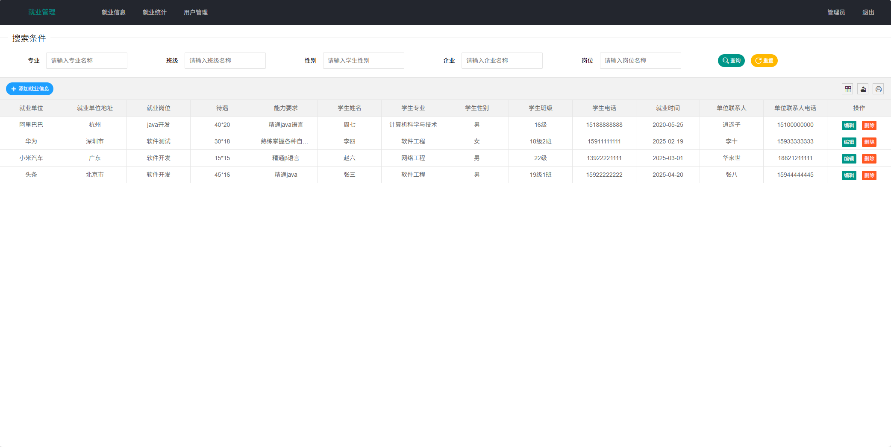
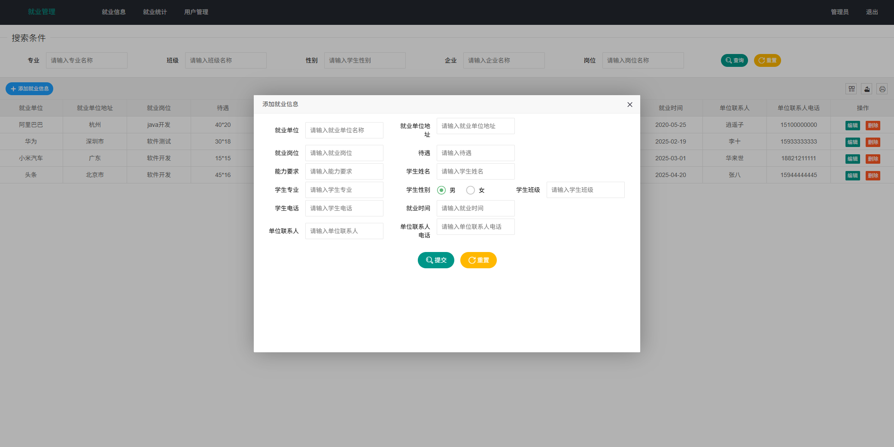
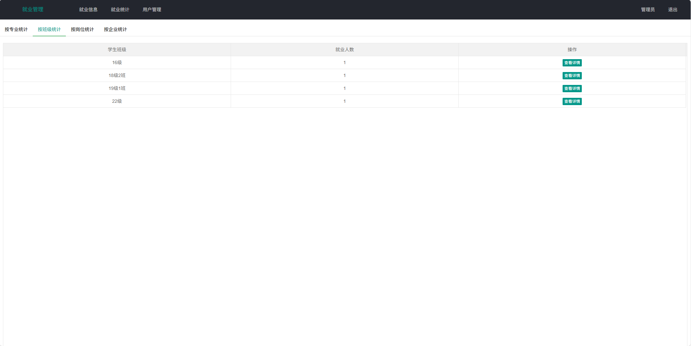
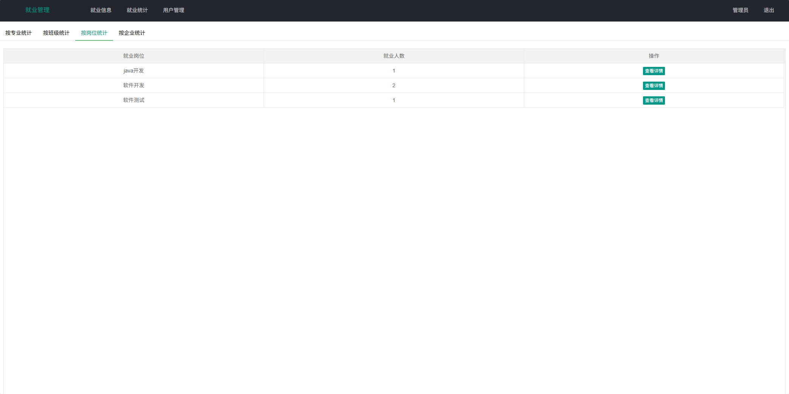
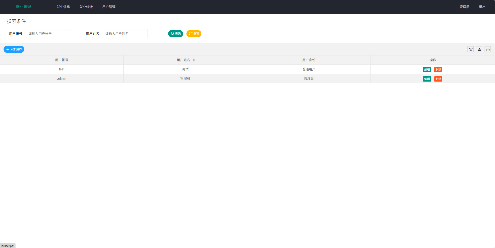

# 就业管理系统(文末免费领取☟)
> 
#### 介绍
就业管理系统(Java_SpringBoot)
有BUG可留言加微

#### 软件架构
Java + SpringBoot + Mybatis + thymeleaf + Mysql

#### 项目功能说明

> + 就业信息：增删改查
> + 就业统计：按专业统计、按班级统计、按岗位统计、按企业统计
> + 用户管理：增删改查

### 部分功能演示

### 环境需求(可免费提供)
- idea/eclipse、jdk-1.8、maven-3.8.6、mysql、node.js等

## 有项目修改、安装调试需求 请联系以下

## 获取资源扫☝☝☝

